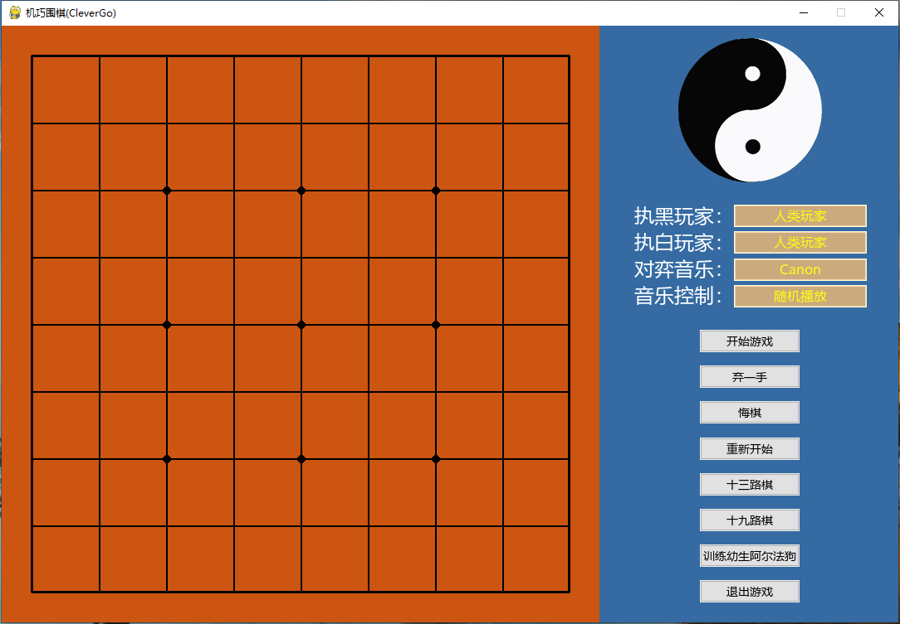
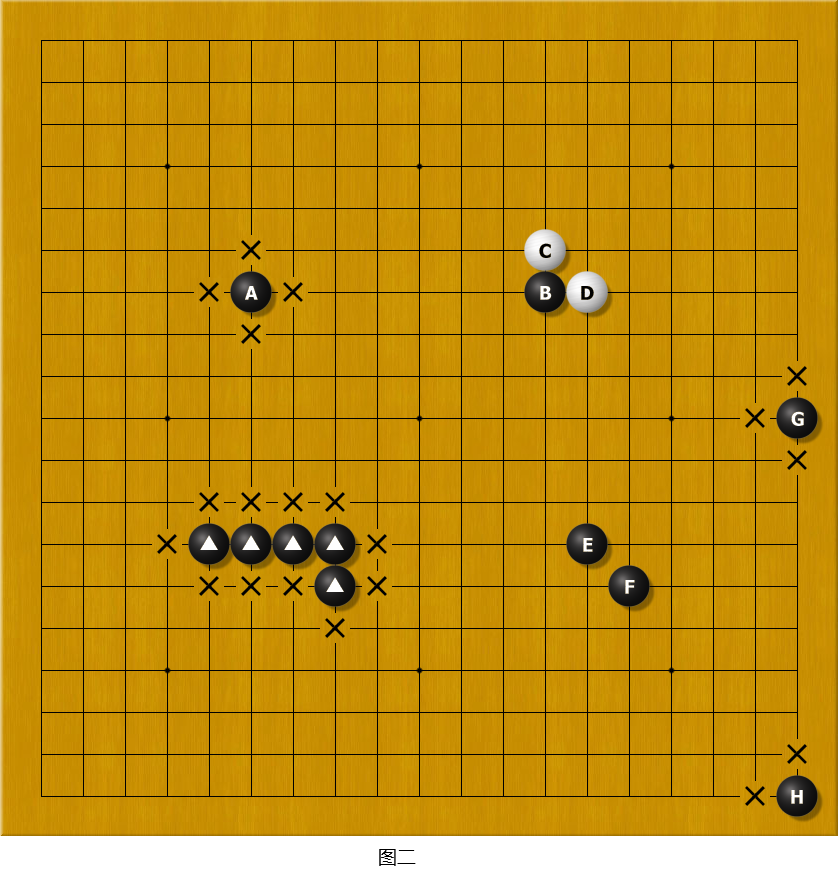
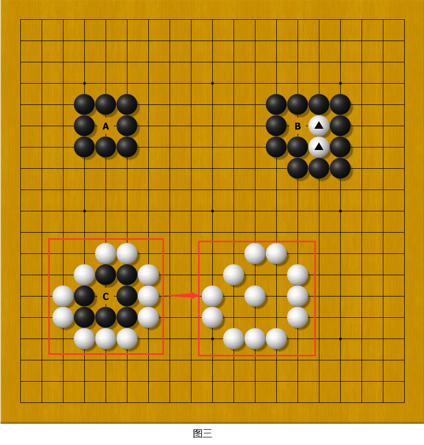
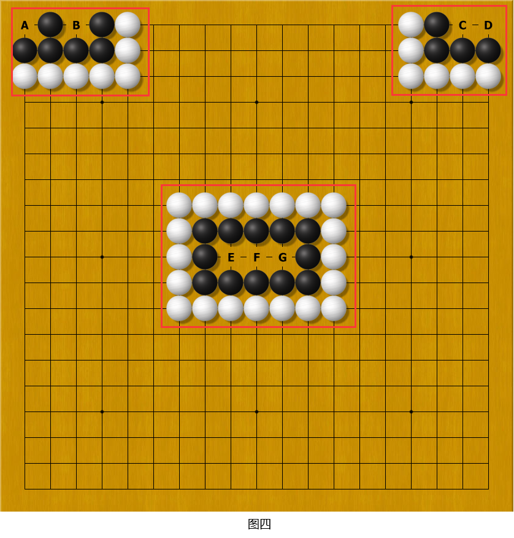
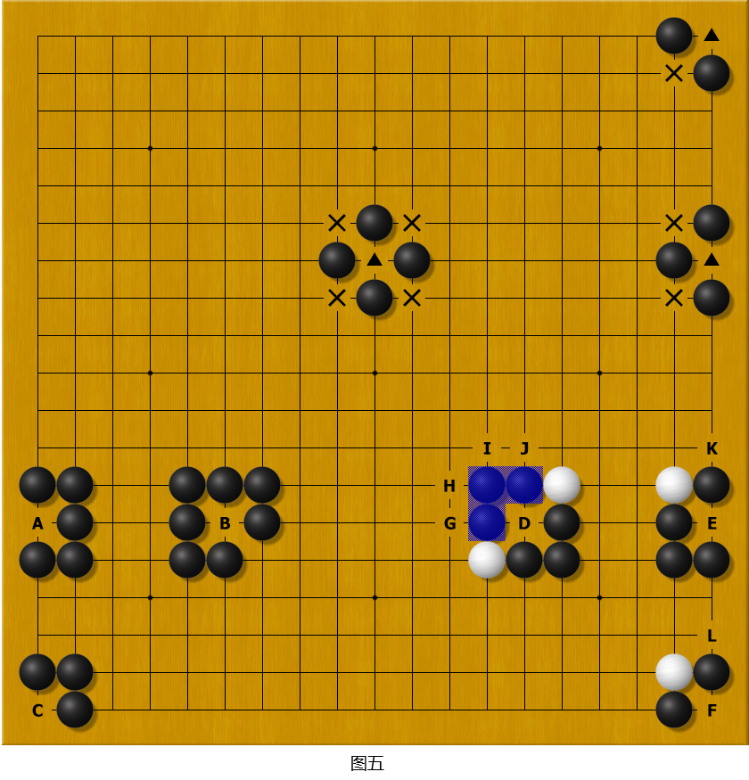
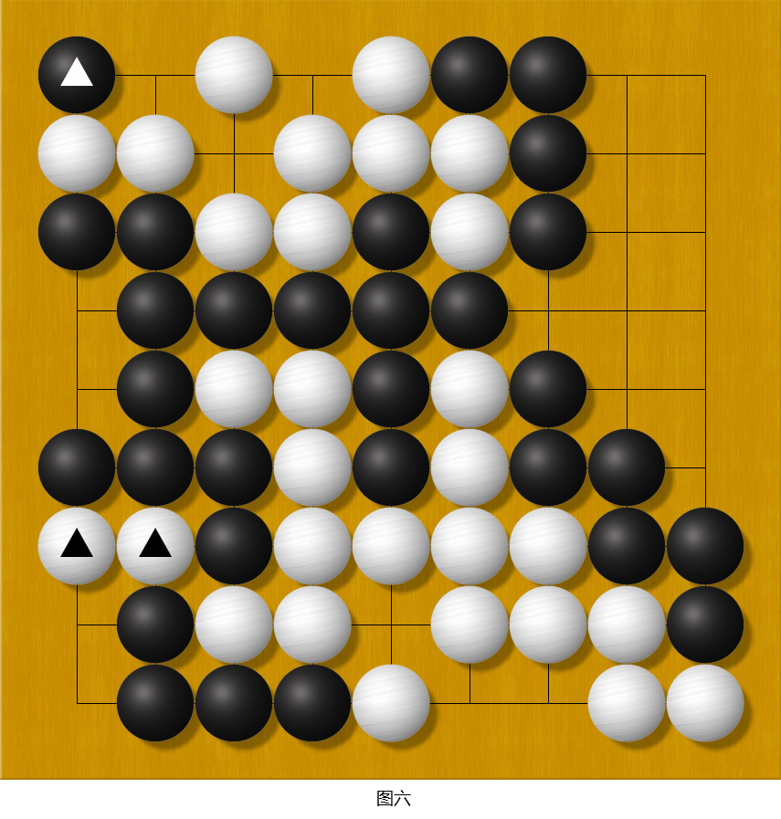
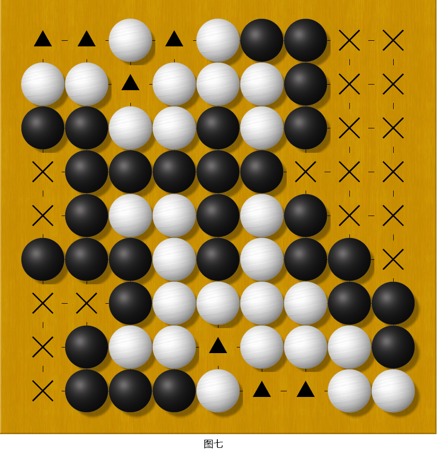
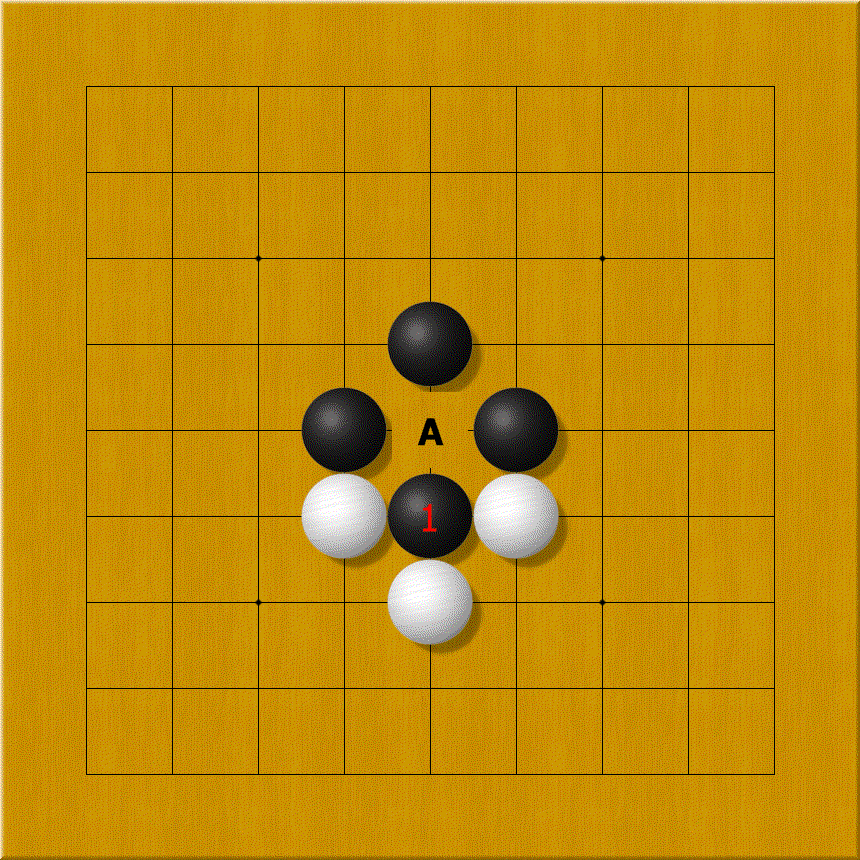
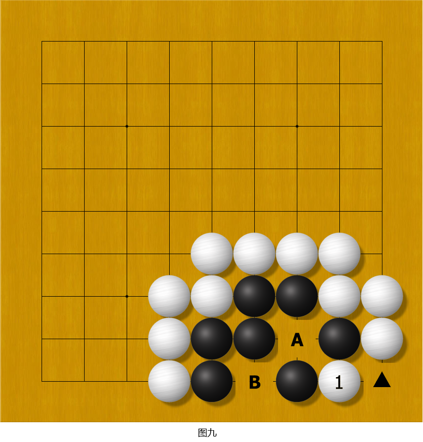

# 围棋基本知识

科普知识：围棋使用格状棋盘及黑白二色圆形棋子进行对弈，棋盘上有纵横各19条线段将棋盘分成361个交叉点。在野狐、奕城等各大围棋平台，除19路围棋外，还存在9路和13路围棋用于练习和娱乐。9路围棋即棋盘由纵横各9条线段分成81个交叉点，13路围棋即棋盘由纵横各13条线段分成169个交叉点。围棋以围地多者为胜，被认为是世界上最复杂的棋盘游戏。

由于13路和19路围棋复杂度较高，训练相应的围棋AI所需计算资源非常多，所需训练时间非常长，由于硬件和时间限制，{本Sigma-go围棋bot主要提供9路围棋一键式训练功能}（原理和19路是一致的）。

本文介绍围棋规则及基本行棋知识。

## 1. 围棋规则

### 1.1 围棋棋盘

如图一所示，围棋棋盘上有纵横9条线段，共构成了81个交叉点，其中包括9个标记的交叉点。中间的被标记的交叉点叫做“天元”，其余被标记的交叉点叫做“星位”。星位和天元的作用是帮助对局者更方便地定位棋盘上交叉点的位置，无其余作用。

### 1.2 基本下法

1. 对局双方各执一色棋子，黑先白后，交替下子，每次只能下一子；

2. 棋子下在棋盘上的交叉点上；

3. 棋子下定后，不得再向其他位置移动；

4. 轮流下子是双方的权利，但允许任何一方放弃下子权而使用虚着。

### 1.3 基本规则

1. 无气自提；
2. 禁止全局同形再现；
3. 地大者胜。

> 全局同形再现是妨碍终局的唯一技术性原因，原则上必须禁止。禁止全局同型再现包括以下内容：
>
> 1. 禁止单劫立即回提；
> 2. 禁止假生类多劫循环；
> 3. 原则上禁止三劫循环、四劫循环、长生、双提两子等全局同形再现的罕见特例。根据不同比赛，也可制定相应的补充规定，如无胜负、和棋、加赛等。
>
> 在一般围棋比赛中，只会严格禁止单劫立即回提和禁止假生类多劫循环，三劫循环等情况一般作无胜负处理。由于假生类多劫循环、三劫循环等情况非常罕见，文本讲解围棋基本知识默认禁止全局同形再现等同于禁止单劫立即回提，不考虑其余两种情况。
>
> 上述规则的具体含义将在下面基本行棋知识部分讲解。

## 2. 基本行棋知识

### 2.1 棋子的气

当一个棋子被放置到棋盘的某个交叉点上，其直线相邻的交叉点就是该棋子的气，气的单位为“口”。如图二所示，棋子A共有4个**X**所在位置的4口气。

可将不同颜色的棋子放置在一个棋子直接相邻的交叉点，以堵住或填掉相应棋子的气。图二中黑子B的4个直接相邻交叉点中有两个位置存在白子C和D，则黑子B只有2口气。同样的，白子C和D分别存在3口气。

若棋子位于棋盘边线上，显然只存在3个与其直线相邻的交叉点，即只有3口气。若位于棋盘的角上，则只存在2个与其直接相邻的交叉点，即只有2口气。图二中黑子G只有3个**X**所在位置的3口气，黑子H只有2个**X**所在位置的2口气。

若多个相同颜色的棋子连在一起，则这些棋子必须被视为一个整体，称为一块棋。一块棋的气是共用的，而且同生共死。图二中△标识的5个黑子连在了一起，因此为一块棋。△标识的5个黑子所组成的这一块棋共有11个**X**所在位置的11口气。黑子E和F没有连在一起，因此他们不是一块棋。

棋子的气即为棋子的生命，若一块棋(单独的一颗棋子也可以视为一块棋)的所有气均被堵住，则该块棋子被杀死，必须从棋盘上全部提掉(拿走)，即**无气自提**。

### 2.2 禁着点

在围棋棋盘上，并不是所有空的交叉点均能够放置棋子(已经存在棋子的位置当然不能够放置棋子啦)，这些位置被称为禁着点。分为如下两种情况：

1. 己方棋子放入后呈无气状态且不能吃掉任意周围的对手棋子；
2. 己方棋子放入后使得对手面临其上一手落子时相同的局面。

如图三所示，空交叉点A位置和B位置均为白方的禁着点。A位置白方棋子放入后呈无气状态，B位置白方棋子放入后，放入的棋子与▲标识的两颗白子一起所组成的一块棋呈无气状态，而且不能吃掉周围的对手的棋子。

C位置不是白方的禁着点，因为虽然白方棋子放入后呈无气状态，但是在C位置放入白子可填掉周围黑子的最后一口气，即可提掉周围无气的黑子。在围棋规则中，一方落子后，判定对手棋子的状态优先于对己方棋子状态的判定，白方在C位置放入一颗白子，吃掉周围黑子，会使得自己刚放入的棋子是有气的。白方在C位置放入一颗白子，左框局面会变成右框状态。

> 第2种情况在围棋中有更为专业的表示，即“劫争”。本节不对第2种情况进行展开，请参见第**2.6**部分。

### 2.3 死棋与活棋

思考下图左上角方框中所示情况，其中A位置和B位置均为白棋的禁着点，如果黑棋不主动在A位置和B位置放置棋子，白棋能够把黑棋吃掉吗？

答案是否定的。只要黑棋不在A位置和B位置放置棋子，则任何时候白棋均不能在A位置或B位置放置棋子，因此黑棋不论如何均不会被吃掉。A位置和B位置被称为黑棋的“眼”。一块棋子如果有不少于两只眼，则该块棋子则是活棋，否则为死棋。

> 注意，一块棋子有不少于两只眼则为活棋，但是一块棋只有在没有气的情况下才会被提掉。

再思考图四右上角方框中所示情况，方框中的黑棋是活棋吗？

答案也是否定的，虽然黑棋目前有两口气，但是其只有一只眼。白方要杀黑棋，只需要在C位置或者D位置放置一颗棋子。如果白方在C位置放置一颗棋子，黑棋不论是否在D位置放置棋子，这块黑棋均会只有一口气。黑棋如果不在D位置放置棋子，则白方只需要进一步在D位置放置一颗棋子，即可吃掉这块黑棋。黑棋如果在D位置放置棋子，吃掉白方在C位置放置的白子，这块黑棋仍然会只有一口气(因为D位置多了一颗黑子)，白方只需要在C位置放入一颗棋子，即可吃掉这块黑棋。

再思考图四中间方框中所示情况，如果此时轮到黑棋下，黑棋该如何是的自己的这块棋变成活棋呢？

答案是下在F位置。因为如果黑棋在F位置放入一颗棋子，则E位置和G位置均会变成白棋的禁着点，这块黑棋有了2只眼，因此成为活棋，永远也不会被白棋吃掉。同理如果此时轮到白棋下，白棋只需要在F位置放入一颗棋子，则黑棋无法做出2只眼，无法做活，免不了被白棋吃掉的结局。

> 注意，禁着点并不与眼等同。

### 2.4 真眼与假眼

一个空交叉点周围4个直接相邻的交叉点上均有黑子（在边线上即3个直接相邻的交叉点上均有黑子，在角落上即2个直接相邻的交叉点上均有黑子），则该空交叉点为黑棋的眼。对于白棋亦然。

如图五所示，三个▲标识的位置均为黑棋的眼。眼的4个角落是该眼的眼角，即图五中**X**位置分别是对应眼的眼角。若一个眼是真眼，当该眼位于中央，则必须至少占领3个眼角。当该眼位于边线上，则必须占领全部两个眼角。当该眼位于角落，则必须保证占领唯一的一个眼角。否则眼即为假眼。即在图五中，眼A、B、C均为黑棋的真眼，眼D、E、F均为黑棋的假眼。

为什么空交叉点D、E、F均是黑棋的假眼？

对于空交叉点D来说，如果白棋依次落子GHIJD，则阴影标识的三个黑子将被吃掉，相应的眼D将不复存在。对于空交叉点E和F也是同理。即假眼是能够被对手破坏的眼，真眼是对手无法破坏的眼。一块棋只有存在大于或等于两只真眼才是活棋。

### 2.5 胜负的计算

在围棋游戏中胜负分为两种情况：

1. 中盘胜/中盘负：如果在对局过程中，白方认输，则黑中盘胜，或白中盘负；
2. 围棋游戏进行至某一局面，黑白双方协商终局，通过围地大小判定胜负。

当黑白双方协商终局，按照如下3个步骤计算胜负：

1. 清理死子：

   在图六中，▲标识的黑子和白子均为死子，因为在一人一手轮流落子的情况下，这些棋子无法做成两只眼，免不了被吃掉的结局。

   

2. 分别计算黑棋和白棋所为围住的地盘大小（围住的空交叉点数+相应颜色的棋子数）：

   如图七所示，黑棋共围住了**X**所示的18个交叉点，再加上棋盘上共有29颗黑子，因此黑棋地盘为18+29=47。白棋共围住了▲所示的7个交叉点，再加上棋盘上共有27颗白子，因此白棋地盘为7+27=34。

   

3. 计算胜负：

   在图七所示的棋盘上，总共有9*9=81个交叉点，则整个围棋棋盘中一半的地盘为40.5。因为黑棋先行，具有先招优势，因此在计算胜负时，黑棋需要贴三又3/4子，即黑棋所围住的地盘，必须超过棋盘中一半的地盘还要多三又3/4（即44.25），才能算胜利。因为黑棋地盘为47,47-44.25=2.75，因此对局结果为黑胜2又3/4子。

> 协商终局：协商终局是指对局双方均认可地盘划分现状。因为在一人一手交替落子的情况下，双方均认为不可能更改目前的地盘占领情况。
>
> 黑贴3又3/4子：这是中国围棋规则所规定的，是中国围棋协会根据职业棋手对局情况商讨定下来的一个比较合理的值。

### 2.6 劫

在下图中，1位置黑棋只有1口气。此时白棋如落子A位置，则可以吃掉1位置的黑子。当白棋吃掉1位置黑子，规则规定黑棋不能马上将2位置白子吃掉。如果黑棋马上将2位置白子吃掉，则会导致白棋面临上一手落子时相同的局面，即此时被吃掉的1位置黑子处的空交叉点为黑棋的禁着点。这种黑白双方在同一个位置反复吃掉对方一颗棋子的情况称为“劫”，黑白双方争夺“劫”所在位置的空交叉点的情况称为“劫争”或“打劫”。

> 为什么规则要这么规定？
>
> 其实很好理解。如果允许白棋吃掉1位置黑子之后，黑棋能够马上重新落子1位置吃掉2位置白子，显然这会导致双方提来提去，一局棋永远下不完。

#### 2.6.1 劫争的意义

如图九所示，白棋落子1位置，吃掉▲处原本存在的一颗黑子，在▲处形成了一个劫。因为A位置是黑棋的假眼，这一整块黑棋只有B位置一个真眼。因此黑棋如果想要做出两只真眼，形成活棋，则必须赢下这个劫争，即占领▲位置。

由于此时黑棋不能马上落子▲位置，吃掉1位置白子，因此黑棋可以在棋盘上其它关键位置落子，使得白方来不及落子▲位置，则再次轮到黑棋落子时，黑棋可落子▲位置，使得这块黑棋能够做出两只眼，成为活棋。

> 所谓的关键位置即称为“劫材”，黑棋落子后，如果白棋不理，则黑子再下一子可给白方造成很严重的损失。
>
> 劫争是围棋中的一种高级技巧和艺术。在很多棋局中，一个劫争有可能决定多达数十颗棋子的生死存亡，甚至会直接决定一局棋的胜负。

## 3. 作者的话

围棋与中华文化一脉相承，息息相通，下围棋的原则与中华传统文化倡导的为人处世原则是相互统一的。历史上曾记载了关于围棋的十句口诀：

1. 不得贪胜
2. 入界宜缓
3. 攻彼顾我
4. 弃子争先
5. 舍小就大
6. 逢危须弃
7. 慎勿轻速
8. 动须相应
9. 彼强自保
10. 势孤取和

## 4. 围棋学习资料

1. 学习围棋基本规则及常见技巧：[20天从零学会下围棋](https://www.bilibili.com/video/BV1uW411W7xK?p=1)
2. 感受围棋的竞技魅力：[2014 古李十番棋合集](https://www.bilibili.com/video/BV1Rs411B791?p=6)
3. 聆听围棋人工智能与顶尖棋手的对话：[【完整合集】【中英解说】【赛后分析】AlphaGo VS 柯洁 2017中国乌镇·围棋峰会](https://www.bilibili.com/video/BV1ix411Y7M9?spm_id_from=333.999.0.0)
